  

  

## `> ls ./selected-systems --verified`

| System | Function | Evidence |
| --- | --- | --- |
| [TRLCBench](TRLCBENCH_REPOSITORY_URL) | Benchmark for verifier-guided temporal plan repair under genuine duration, concurrency, deadline, and resource constraints | Two PDDL domains, three failure classes, four repair strategies, TRLCScore, OPTIC/VAL validation, and a 64-case evaluation |
| [COUNTERFACT-SWE](COUNTERFACT_REPOSITORY_URL) | Predicts which tests a proposed code patch can affect before executing the complete suite | Detected 8/8 observed failures while selecting 134 of 2,652 tests |
| [OpsPilot](OPSPILOT_REPOSITORY_URL) | Evaluates AI agents for operational diagnosis and remediation | Reproducible failure scenarios, agent baselines, execution traces, and outcome-based evaluation |

## `> cat ./open-source.log`

- **[vLLM #57528 — Offload streaming derender detokenization](https://github.com/vllm-project/vllm/pull/57528)**
  - Moved incremental streaming detokenization off the FastAPI event loop.
  - Added executor-boundary regression coverage and concurrent workload validation.

## `> cat ./build-queue --ordered`

| Priority | System | Intended contribution | Status |
| ---: | --- | --- | --- |
| 01 | **SentinelKWS** | Privacy-preserving, real-time keyword spotting with speaker-disjoint evaluation, open-set unknown/noise handling, calibrated abstention, and NeMo → ONNX → TensorRT deployment | Next build |
| 02 | **Hierarchical Laya** | Remove Laya’s large-option ceiling through hierarchical label selection and calibrated probability composition, evaluated on Banking77 | Research prototype planned |
| 03 | **KAIROS** | SLA-aware inference scheduling across execution backends using latency, throughput, VRAM, energy, and correctness constraints | High-risk systems research |

## `> connect --channels`

[LinkedIn](YOUR_LINKEDIN_URL) ·
[ORCID](YOUR_ORCID_URL) ·
[Email](mailto:YOUR_EMAIL)
